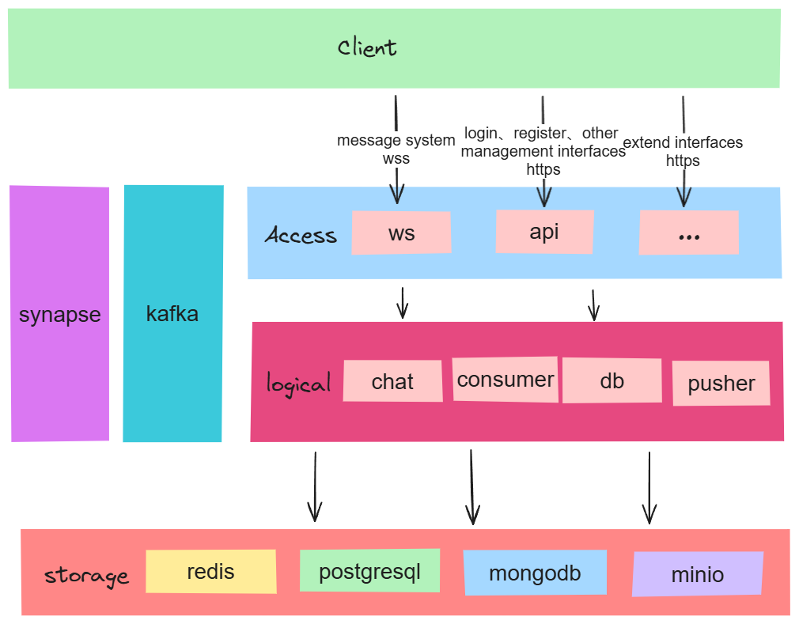

# IM Backend Architecture Description

## Project Overview

This project provides an implementation of a backend for an Instant Messaging (IM) system, developed in the Rust programming language, with a microservice architecture design. Its primary goal is to offer developers an efficient, stable, and scalable IM solution. The focus of this project is to explore and demonstrate the potential and practices of Rust in building high-performance backend services.

## Key Features

- **Microservice Architecture:** The system is split into multiple independent service units, each responsible for a portion of the core business logic and communication with other services.
- **Containerized Deployment:** All services can be packaged with Docker, facilitating deployment and management.
- **Asynchronous Processing:** Utilizes Rust's asynchronous programming capabilities to handle concurrent workloads, enhancing performance and throughput.
- **Data Storage:** Uses PostgreSQL and MongoDB for storing messages permanently and for inbox functionalities, respectively.
- **Message Queue:** Leverages Kafka as a message queue to support high concurrency message pushing and processing.

## Architecture Components



1. **Service Layer**

   - **Authentication Service:** Handles user registration, login, and verification.
   - **Message Service:** Responsible for message sending, receiving, and forwarding.
   - **Friend Service:** Manages the user's friends list and status.

   - **Group Service:** Takes care of group creation, message broadcasting, and member management.

2. **Data Storage Layer**

   - **PostgreSQL:** Storing user information, friendship relations, and message history, along with automated archival through scheduled tasks.
   - **MongoDB:** Acts as a message inbox, handling offline message storage and retrieval.

3. **Middleware Layer**

   - **Kafka:** Provides a high-throughput message queue to decouple services.
   - **Redis:** Implements caching and maintains message status to optimize database load.

4. **Infrastructure Layer**

   - **Docker and Docker-Compose:** Containers for building and deploying services.
   - **Synapse:** For service registration and discovery.
   - **MinIO:** An object storage solution for handling file uploads and downloads.

## Performance and Scalability

   The project is designed with high performance and horizontal scalability in mind. Through asynchronous processing and a microservice architecture, the system is capable of scaling effectively by increasing the number of service instances in response to the growing load. Additionally, the project adopts a modular design philosophy that allows developers to customize or replace modules as needed.

## Unresolved questions

- **Integrating Member ID Retrieval from Cache into DB Service**: Whether the method for retrieving member IDs from the cache should be integrated into the DB service is under consideration.
- **Friendship Redesign**: The current design for representing friendships is inadequate and requires a thorough redesign. --rebuilding
- **Conversation Feature**: There is currently no implementation of conversations on the server-side, as it exists only client-side.
- **Partition Table for Messages (Mongodb) Not Implemented**: The strategy for implementing partitioned tables for messages has not been realized yet.
- **User Table Should Add Login Device Field**: There should be consideration to add a field for the login device to the user table, which is used to check if clients need to sync the friend list.
- **Friendship Read Status**: we should delete the Friendship related message after user read it.
- **need to handle friendship/group operations while user desktop and mobile are both online**
- knock off desk from the mobile
- delete minio file by period
- support matrix protocol so that we can import some robot
- maybe we should combine the query send_seq and incr recv_seq into one operation with lua
- add error detail, so that we can log it, but response to frontend need to be short

## Development

1. install `librdkafka`

   **Ubuntu：**

   ```shell
   apt install librdkafka-dev
   ```

   **Windows:**

   ```shell
   # install vcpkg
   git clone https://github.com/microsoft/vcpkg
   cd vcpkg
   .\bootstrap-vcpkg.bat
   # Install librdkafka
   vcpkg install librdkafka
   .\vcpkg integrate install
   ```

2. run docker compose

   ```shell
   docker-compose up -d
   ```

   **important:** make sure all the third service are running in docker.

3. install sqlx-cli and init the database

   ```shell
   cargo install sqlx-cli
   sqlx migrate run
   ```

4. clone the project

   ```shell
   git clone https://github.com/Xu-Mj/sandcat-backend.git
   cd sandcat-backend
   ```

5. build

   - **Linux：** use the static feature

     ```shell
     cargo build --release --features=static --no-default-features
     ```

   - **Windows:** use the dynamic feature

     ```shell
     cargo build --release --features=dynamic
     ```

6. copy the binary file to root path

   ```shell
   cp target/release/cmd ./sandcat
   ```

7. run

   ```shell
   ./sandcat
   ```

   if you need adjust some configuration, please modify the `config.yml`

**important:** Given that our working environment may differ, should you encounter any errors during your deployment, please do let me know. Together, we'll work towards finding a solution.

## Contributing

We follow [Trunk's](https://github.com/trunk-rs/trunk.git) Contribution Guidelines. They are doning a great job.

Anyone and everyone is welcome to contribute! Please review the [CONTRIBUTING.md](./CONTRIBUTING.md) document for more details. The best way to get started is to find an open issue, and then start hacking on implementing it. Letting other folks know that you are working on it, and sharing progress is a great approach. Open pull requests early and often, and please use GitHub's draft pull request feature.

## License

sandcat is licensed under the terms of the MIT License.
