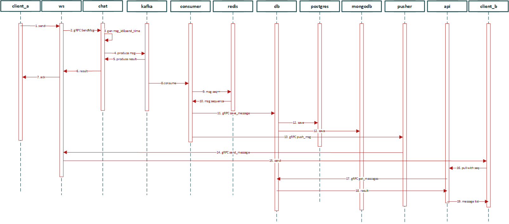

项目的整体架构采用了微服务架构，将系统拆分成多个独立的服务单元，每个服务单元负责核心业务逻辑的一部分，以及与其他服务的通信。
服务之间的通讯采用了gRPC协议。

接下来，我将详细阐述从客户端a向客户端b发送一条消息的完整架构流程：

1. 客户端a向消息服务发送一条消息，消息服务将消息发送到chat服务。
2. chat服务生成server_id以及send_time并将消息发布到kafka消息队列。
3. chat服务将发布结果返回给websocket服务，发布成功即代表消息发送成功
4. websocket服务返回一个发送结果给客户端a
5. consumer服务从kafka消息队列中获取消息，根据用户id增加用户缓存（redis）中sequence。
   将消息存储到postgres中作为历史记录；存储到mongodb中作为收件箱消息，
6. 同时consumer服务将消息发送到pusher服务，
7. pusher服务会将消息发送到所有的websocket服务，
8. websocket服务根据receiver_id将消息发送到客户端b。

我们采用kafka作为消息的主队列，实现了异步处理，提高了系统输入和输出的速度。同时，微服务架构使得整个系统更易于扩展和维护。
**整个架构主要分为一下几大模块：**

1. **服务层**
    - **认证服务:** 处理用户的注册、登录和验证。
    - **消息服务:** 负责消息（单聊、群聊）的发送、接收和转发。
    - **好友服务:** 管理用户的好友列表和状态。
    - **群组服务:** 管理群组的创建和成员管理。

2. **数据存储层**
    - **PostgreSQL:** 负责存储用户信息、好友关系和消息历史，结合定时任务实现数据的自动归档。
    - **MongoDB:** 用作消息的收件箱，处理离线消息的存储和查询。

3. **中间件层**
    - **Kafka:** 提供高吞吐量的消息队列，使服务之间解耦。
    - **Redis:** 实现缓存和消息状态的维护，优化数据库加载。

4. **基础设施层**
    - **Docker和Docker-Compose:** 用于构建和部署服务的容器。
    - **Consul:** 服务的注册与发现。
    - **MinIO:** 对象存储解决方案，用于文件上传和下载。

### 消息服务
1. ws服务：采用websocket协议，用来与客户端保持连接，同时能够实现服务端主动推送消息到客户端，基于axum的websocket实现。

   1. 管理用户的连接状态，维护用户的连接池。这里通过一个Map来维护用户的连接状态，key为用户的id，value同样也是一个Map，子Map的key是用户的指纹id（浏览器id或者机器id），value为用户的连接；这样设计的目的是能够使得用户能够多端同时在线，（ 但是目前暂时没有实现多端消息发送的同步， 同平台在线状态踢出也暂时没有实现）。
   2. 将用户发送过来的消息通过gRPC发送到chat服务，chat服务将消息发送到kafka消息队列，写入消息队列即代表消息发送成功，返回给用户发送成功的消息。
   3. 将消息推送给在线的用户，不在线的直接丢弃
2. chat服务： 接收ws服务发送过来的消息，生成server_id和send_time，将消息写入kafka消息队列。
3. consumer服务：
   1. 从kafka消息队列中获取消息，
   2. 增加用户缓存（redis）中sequence。
   3. 将消息通过gRPC发送到db服务。
   4. 将消息发送到pusher服务，
   这里3、4是使用两个tokio的task并行处理的。（这块的设计感觉还存在一些问题，都还没来得及解决；比如：这里存在着两个网络IO的调用，是存在发送失败的风险的，这里还没有对发送失败做很好的处理）
4. db服务：
   1. 将消息存储到postgres中作为历史记录；
   2. 将消息存储到mongodb中作为收件箱消息，
   3. 为认证服务、好友服务、群聊服务提供数据存储的接口。
   4. 为用户拉取离线消息提供接口。
5. pusher服务：将消息发送到所有的websocket服务，这里是直接发送给所有的ws服务（因为考虑到规模肯定不大，一个websocket能够处理几万个连接，所以这里就直接发送给所有的ws服务了）。

### 认证服务、好友服务、群聊服务被统一封装到api服务中，采用http协议对外提供服务。
1. 用户接口：注册、登录、修改用户信息、查找用户信息
2. 好友接口：添加好友、删除好友、拉取好友列表
3. 群聊接口：创建群聊、拉取群聊成员、修改群聊信息、邀请好友加入群聊、退出群聊、解散群聊
4. 消息接口：拉取离线消息
5. 文件接口：上传文件、下载文件。采用了minio作为文件存储服务，基于aws_sdk_s3实现。

### 数据库设计
1. postgres：用户表、好友表、消息表、群聊表、群成员表
2. mongodb：用户消息表
这里消息的历史记录都存到了postgres中的同一张表中，使用分库分表的方式来降低单表的数据量。同时postgres中的消息数据是不会变动的。
消息的收件箱存到了mongodb中，这里的设计是为了能够更好的支持离线消息的存储和查询。

### 缓存
缓存使用了redis，
1. 用户的sequence存储在redis中，用来保证消息的有序性。
2. 在线用户id状态也存储在redis中（暂时没用）。
3. 群聊的群成员id存储在redis中，用来减少处理群聊消息时数据库的查询次数。
