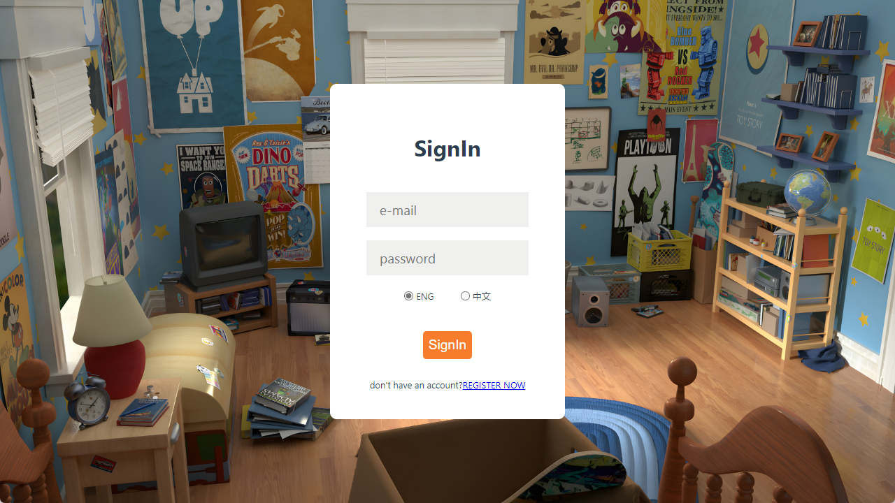
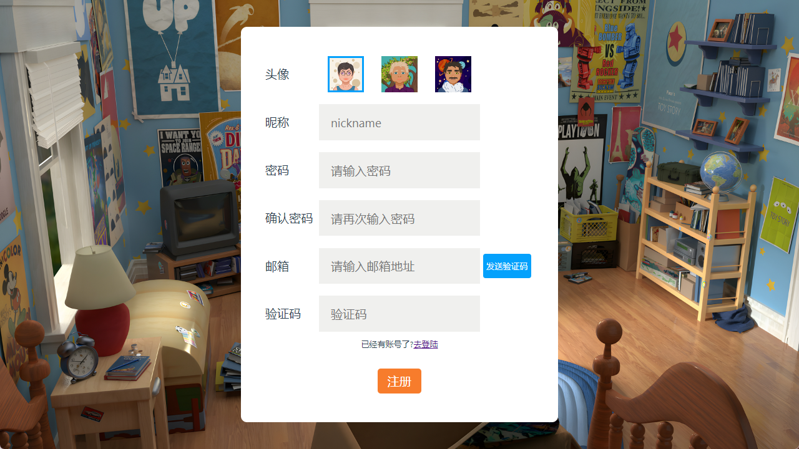
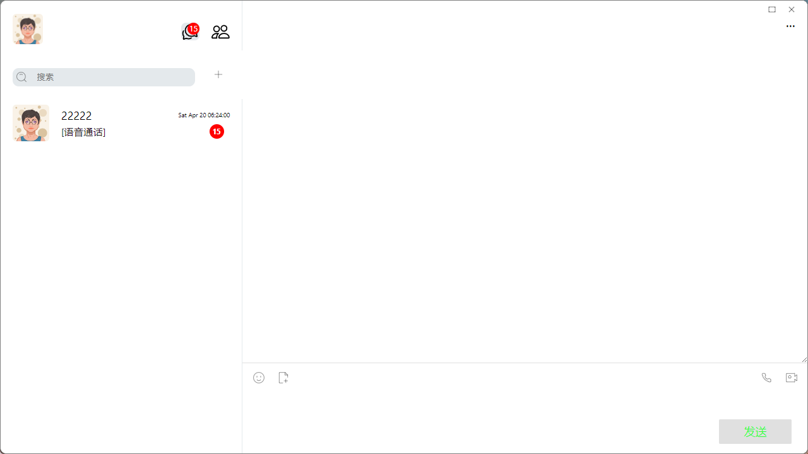
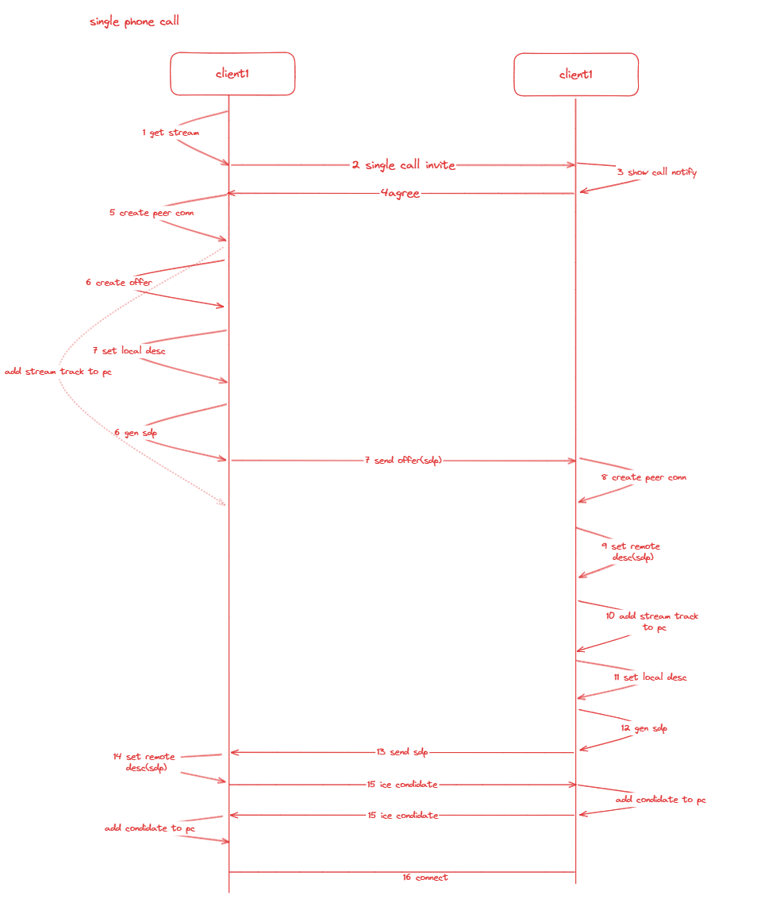

# 基于Rust打造一个分布式可伸缩部署的IM应用

在当今数字化时代，即时通讯（Instant Messaging，IM）应用已经成为日常生活和工作中不可或缺的沟通方式。面对海量用户的需求和不断变化的业务场景，如何打造一个高效、安全且能够轻松应对流量高峰的IM应用成为了开发者面临的一大挑战。本项目致力于开发一款基于Rust语言的分布式IM应用，以其出色的性能、安全性和内存安全的特性，实现了一个高可靠性和可伸缩性的前后端解决方案。

得益于Rust的零成本抽象和无数据竞争的并发模型，我们的IM应用在保证高性能的同时，极大地提高了系统的稳定性和安全性。后端系统采用了微服务架构，从而使功能模块之间的解耦更加彻底，每一部分都可以独立部署和扩展，以应对不断增长的服务需求和复杂的业务逻辑。

通过分布式设计，我们将核心的IM功能如消息传递、状态同步、用户管理等划分为单独的服务单元，每个单元都可以在多个服务器上横向扩展，实现真正的分布式处理。这样的部署方式不仅提升了整体服务的可用性和容错性，也极大地方便了后续的系统升级和维护。

在前端，我们同样选择Rust开发，并通过WebAssembly将Rust代码运行在浏览器中，以此带来原生级别的性能和快速的执行速度。

## 技术选型

#### 后端技术选型

我们后端服务的构建充分利用了Rust的生态系统，主要采用以下技术和框架：

- **Axum**：一个高效的web框架，提供了强大的抽象，支持构建高性能的异步应用。
- **Tonic**与**gRPC**：用于创建高性能的RPC服务，实现服务间高效通信。
- **Kafka**：作为分布式消息队列，kafka处理大规模数据流同时保持高吞吐率。
- **PostgreSQL**与**SQLx**：我们选择了PostgreSQL作为关系型数据库，搭配SQLx实现异步数据库操作。
- **MongoDB**：作为非关系型数据库，用以处理更灵活的数据结构，及收件箱等特定功能的数据存储。
- **MinIO**：一种高性能的对象存储解决方案，用于存储用户的文件和媒体资料。
- **Redis**：作为缓存和消息中间件，实现快速数据读取和状态管理。
- **Consul**：提供服务发现和配置，保持微服务的高可用性和弹性。

#### 前端技术选型

在前端，我们选择了**Yew**框架，这是一个基于Rust的前端框架，可以编译成WebAssembly，从而在浏览器中提供接近原生的运行速度和更好的性能表现。

## 产品最终效果图

- 登录页面

  

- 注册页面

  

- 聊天页面

  

- 联系人页面

  

## 技术实现

目前软件主要实现了基本的IM应用的功能，包括基础的好友系统、单聊、群聊、单聊音视频通话。同时支持了i18n目前支持中英文切换。

### 单聊/群聊

通过WebSocket协议实现了实时的单聊和群聊消息功能。消息在接收后，根据其类型进行相应的处理流程。以下是主要特点及实现细节：

1. **实时消息传输**：
   - 所有的即时通讯交互均基于WebSocket协议完成，保证了高效的双向通信和较低的延迟。
2. **消息序列验证**：
   - 每条消息都有一个与之关联的顺序标识（sequence）。客户端会依据此sequence检查是否存在漏收的消息。
   - 若检测到消息缺失，系统将通过比较本地和服务器端的sequence记录，进行必要的消息补全操作。
3. **消息存储机制**：
   - 处理完毕的消息会被安全地保存至IndexedDB数据库中，方便用户之后的查询和查看，实现本地持久化存储。
4. **断线重连策略**：
   - 系统内置了断线重连机制，当WebSocket连接意外断开时，能够自动尝试重新建立连接，确保用户体验的连续性。
5. **前端技术实现**：
   - 相较于后端复杂的架构体系，前端实现侧重于运用Rust的特性，诸如闭包、回调函数以及生命周期管理等知识点，以实现轻量且高效的客户端通信。

通过综合运用这些策略和技术，单聊和群聊消息系统旨在提供连续无缝的通信体验。

### 好友系统

​	结合了HTTP请求与WebSocket通信，以确保功能的高效性和实时性。好友系统主要涉及以下功能模块：

1. **搜索好友功能**：
   - 用户可以通过手机号、邮箱地址或用户账号进行好友搜索。
   - 搜索操作基于HTTP协议实现，仅支持精确匹配方式。
2. **添加好友请求**：
   - 用户在获取搜索结果后，填写必要的申请信息，通过HTTP请求向服务器发起添加好友的操作。
   - 服务器接收到添加请求后，会利用WebSocket实时转发请求信息至被请求用户，确保及时通知。
   - 请求数据同时被记录在数据库中，且转存入被请求用户的收件箱，以便在用户离线时依旧能够接收到好友请求消息。
3. **处理好友请求**：
   - 被请求用户在线时，或在下次登录时，可以查看并处理好友请求。
   - 在线用户处理好友请求动作（如同意请求）同样会通过HTTP请求发送至服务器。
   - 服务器将处理结果通过WebSocket即时通知至请求发起方，并且记录在数据库与请求发起方的收件箱。这一步骤保证了即便请求发起方当前不在线，也能在上线后得到通知。

通过上述设计，好友系统在实现基础功能的同时，保证了用户交互的即时响应和数据一致性。好友系统目前的设计很脆弱，功能非常有限，会在将来进行重构。

### 群聊

群聊主要包括创建群聊、邀请新的成员加入、退出群聊以及解散群聊，对于客户端的逻辑相对简单，

#### 创建群聊

用户可以轻松创建一个群聊，并邀请他们的好友加入。这一过程的实现步骤如下：

- 用户在应用中选择需要邀请的好友，随后点击“创建群聊”按钮。这时，客户端会搜集并发送邀请的群聊成员ID、头像以及其他必要信息给服务端。
- 服务端处理这些信息后，会创建群聊并返回新群聊的详细信息，包括群聊的ID、群聊成员的列表和一般的群聊信息。
- 客户端接收到这些信息后，将会更新本地数据库，包括群聊信息表和群聊成员信息表，保证用户界面能够及时反映新创建的群聊及其成员信息。
- 被邀请的成员将通过WebSocket收到通知，包含群聊的详细信息及成员列表。收到邀请的用户同样需要在本地相应表中更新以上信息。

#### 邀请新成员加入

在群聊创建后，群聊成员可能需要邀请更多的好友加入群聊。这一功能的实现逻辑如下：

- 现有群聊成员可通过界面上的“邀请成员”选项，选择并邀请新的好友加入群聊。
- 确认邀请后，客户端会将被邀请人的信息发送至服务端，并请求更新群聊成员列表。
- 服务端接收并处理这一请求后，会更新群聊数据库中的相关信息，并通知所有群聊成员新成员的加入。
- 新成员将通过WebSocket消息获得群聊邀请，此消息含有群聊的基本信息和现有成员列表。接受邀请后，新成员也会在本地数据库中更新群聊信息，完成加群流程。

#### 退出群聊和解散群聊

- **退出群聊**：用户可选择退出群聊，此时客户端会向服务端发送退出请求。服务端处理后将该成员从群聊成员列表中移除，并通过WebSocket通知其他群成员。
- **解散群聊**：群主有权限解散群聊。执行解散操作时，服务端将删除该群聊的所有记录，并通过WebSocket通知所有成员群聊已被解散，客户端在接收到通知后，将相应群聊信息从本地数据库中删除。

### 音视频通话

音视频通话基于浏览器原生api--webRTC实现，算是项目中的一个难点，下面进行详细介绍：

时序图

WebRTC技术为我们的即时通讯提供了音视频通话的可能性。其核心部分建立在我们的websocket服务之上，通过所谓的“信令通道”交换用户之间必要的点对点（P2P）连接信息，比如用于通话的媒体信息（编码格式）、网络信息（包括IP地址和端口号）、以及用于控制通话进行的一些消息。在开始交换这些P2P连接信息之前，我们还需要发送一个通话邀请给接收方。整个过程如下：

1. **发送通话邀请**：首先，用户A通过点击通话按钮向用户B发送一个通话邀请。
2. **收到通话邀请**：用户B收到通话邀请的通知后，可以选择接受或者拒绝。如果用户B接受了通话，系统就开始建立P2P连接。
3. **创建“RTCPeerConnection”对象**：系统会在每一位参与通话的用户的浏览器创建一个RTCPeerConnection对象。这个对象负责管理WebRTC连接的整个生命周期。
4. **交换网络信息（ICE Candidates）**：这是为了让通话双方了解对方的网络环境，包括双方的IP地址和端口号等。
5. **交换会话描述（SDP）**：这一步是为了让双方都了解通话中将要使用的媒体参数，包括媒体的类型、编解码信息等。
6. **NAT穿越和中继（STUN/TURN）**：为了解决用户可能位于NAT 或防火墙后的情况，WebRTC使用了STUN 和TURN 服务器来发现设备的公网IP地址和端口，如果必要的话，可能需要使用中继方式。
7. **建立连接**：当双方交换了ICE候选和会话描述（SDP）后，系统开始尝试建立连接，首先会试图让通话双方直接连接，如果失败，再使用TURN服务器进行中继。
8. **媒体流传输**：一旦连接建立，就可以开始传输媒体流，比如视频和音频了。
9. **通信和维护**：在通信过程中，我们还会维护对方的状态，适时更新ICE候选，确保通话的稳定性。
10. **关闭连接**: 通话结束后，我们需要关闭RTCPeerConnection，结束会话。

整个过程，除了建立P2P连接这部分WebRTC会自动完成外，其余部分如通话邀请、通话邀请取消、通话超时、通话挂断等需要我们自行设计和实现。总的来说，WebRTC流程繁多但层层递进，最终实现了安全、高效的音视频通话功能。

**总结：**以上是对整个项目的整体概述以及一些功能的实现介绍，整个项目还在快速开发迭代中，感兴趣的话可以持续跟进，后续会对后端架构以及实现细节进行详细表述

项目源码:

- 前端[[Xu-Mj/sandcat: im app frontend (github.com)](https://github.com/Xu-Mj/sandcat)

- 后端[[Xu-Mj/sandcat-backend: im app backend (github.com)](https://github.com/Xu-Mj/sandcat-backend)
